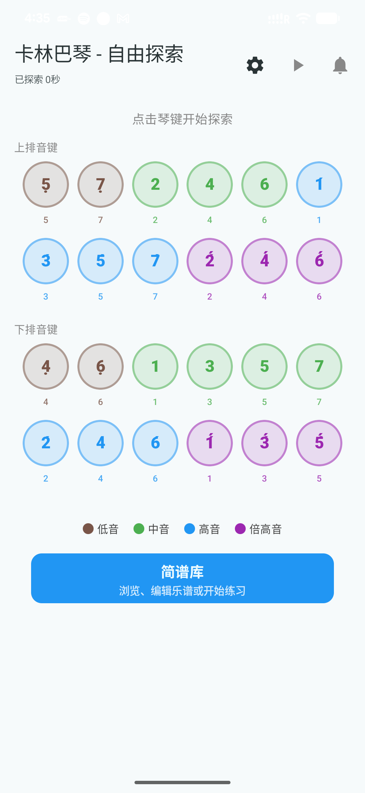
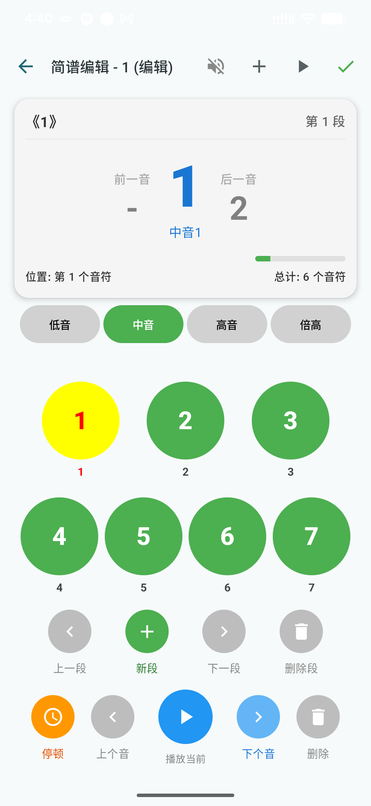
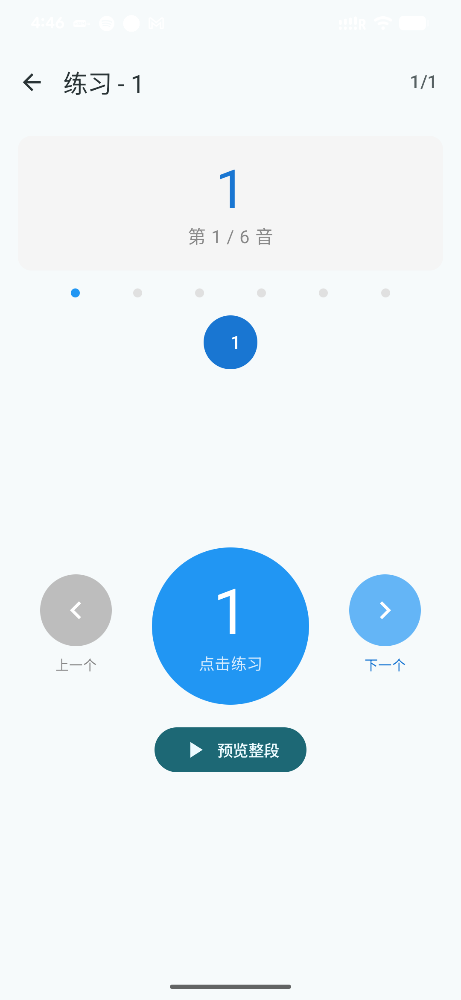

# Harmony Kalimba (和谐卡林巴)

[](LICENSE)
[](https://developer.android.com)
[](https://developer.android.com/jetpack/compose)

**Harmony Kalimba** 是一款专为所有人设计的数字卡林巴琴（拇指琴）应用。除了提供纯净的音质体验外，本项目核心致力于**无障碍音乐创作**，通过深度的视觉、听觉和触觉反馈，让视障人士也能享受学习、创作和分享音乐的乐趣。

## ✨ 核心特性

### 🎹 1. 自由探索模式
- **24键双排设计：** 完美模拟专业卡林巴琴布局。
- **动态视觉反馈：** 涟漪动画与音符同步。
- **智能历史回放：** 记录你的即兴灵感，并支持一键自动播放。

### 📝 2. 全功能简谱编辑器 (NMN Editor)
- **数字化录入：** 针对简谱（Numbered Musical Notation）优化的录入界面。
- **段落管理：** 支持分段创作复杂乐曲。
- **实时预览：** 编辑过程中随时收听当前段落。

### 🎓 3. 交互式练习模式
- **分步引导：** 像音游一样通过视觉和语音提示引导用户弹奏。
- **进度追踪：** 实时显示当前音符位置，支持快速切换乐句。

### ♿ 4. 极致无障碍支持 (Accessibility)
- **自定义 TTS 引擎：** 独立于 TalkBack 的语音播报，告知键位、音高（如“下排第三键，中音1”）。
- **多级触觉反馈：** 使用不同频率的震动区分点击、删除、预览和完成操作。
- **语义化 UI：** 针对屏幕阅读器优化的 Semantics 树。

### ☁️ 5. 云端同步与分享
- **简谱市场：** 在广场浏览并下载他人创作的乐谱。
- **分享码机制：** 通过 6 位分享码快速交换你的简谱作品。
- **安全认证：** 完善的登录/注册系统，支持图形与语音验证码。

## 🛠 技术栈

- **UI框架:** Jetpack Compose (声明式 UI)
- **异步处理:** Kotlin Coroutines & Flow
- **本地存储:** Room Database (存储乐谱), DataStore (存储设置与 Token)
- **网络请求:** Retrofit 2 & OkHttp 3
- **音频引擎:** SoundPool (低延迟采样播放)
- **图片加载:** Coil
- **架构模式:** MVVM (Model-View-ViewModel)

## 📸 界面预览

|                  自由探索                   |               简谱编辑               |              练习模式              |
|:---------------------------------------:|:--------------------------------:|:------------------------------:|
| __ | __ | __ |

## 🚀 快速开始

### 编译要求
- Android Studio Ladybug 或更高版本
- JDK 17
- Android SDK 34+

### 安装步骤
1. 克隆仓库：
   ```bash
   git clone https://github.com/your-username/harmony-kalimba.git
   ```
2. 在 Android Studio 中打开项目。
3. 修改 `data/remote/AuthApiService.kt` 中的 `baseUrl` 为你的后端 API 地址。
4. 运行 `./gradlew assembleDebug` 或直接在真机调试。

## 💡 开发者说明

### 无障碍适配逻辑
项目中的 `AccessibilityHelper` 类是核心。它不仅封装了 `TextToSpeech`，还通过 `VibratorManager` 实现了不同维度的触觉反馈。对于复杂组件（如 `NmnScreen`），我们使用了 `clearAndSetSemantics` 来重构无障碍焦点，避免 TalkBack 播报冗余信息。

### 音频资源
音频资源位于 `res/raw` 目录下，采用高清 44.1kHz 采样，确保音色清脆悦耳。

## 📜 开源协议
本项目采用 [Apache License 2.0](LICENSE) 协议开源。

---

**Harmony Kalimba —— 让每一个人都能拨动心弦。**
如果你喜欢这个项目，请给一个 ⭐️ Star！

---
